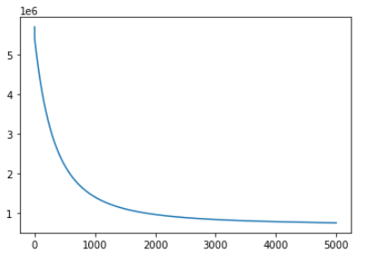

# REPORT

## Linear Regression

### Preprocessing on  diamond dataset

* Since `Unnamed 0` column have unique ids of each sample , drop it.
* `cut`,`color`,`clarity` vlaues are catogorical values.
* Use `One Hot Encoding` to add new dummy columns to data and remove `cut`,`color`,`clarity` columns from data.

* By plotting heatmap we can see that `table`,`depth` columns have very less correlation with `price`,So drop those two columns.
  
### Split Data

* Split the data into `train`,`test` data_frames using `pandas.get_dummies()` .
* Take `train_x` as `train.drop[price]` ,`train_y` as `train.drop[train_x.index]`.
* Take `test_x` as `test.drop[price]` ,`test_y` as `test.drop[test_x.index]`.

### Implementation

* Closed form

{width=30%}

* Gradient Descent

 {width=30%}

* Loss Curve

{width=40%}

#### Mean Squared Value

* Linear regression MSE value is 706210.9102520018

\pagebreak

## Logistic Regression

### Preprocessing on Titanic dataset

* Since `Passenger ID` column have unique ids of each sample , drop it.
* `Sex`,`Embarked` vlaues are catogorical values.
* Use `One Hot Encoding` to add new dummy columns to data and remove `sex`,`Embarked` columns from data.

* Since there are too many Null values in `Cabin` column drop it.
* Replace the Null values of `Embarked`,`Age` with their respective medians.
  
### Split Data

* Split the data into `train`,`test` data_frames using `pandas.get_dummies()` .
* Take `train_x` as `train.drop[price]` ,`train_y` as `train.drop[train_x.index]`.
* Take `test_x` as `test.drop[price]` ,`test_y` as `test.drop[test_x.index]`.

### Implementation

* Cross entropy

{width=50%}

* Gradient Descent

 {width=30%}

* Loss Curve

{width=40%}

#### F1 Score

* Linear regression F1_score value is 0.6055045871559633
